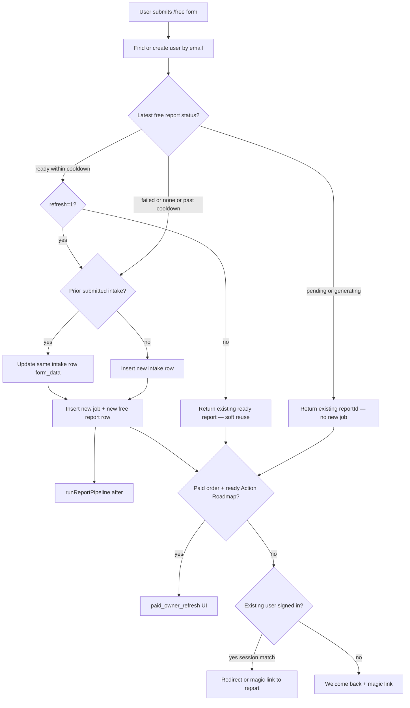
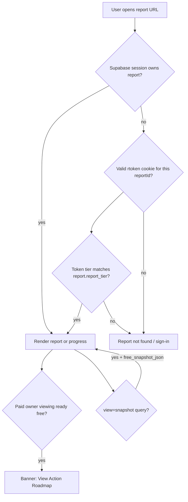
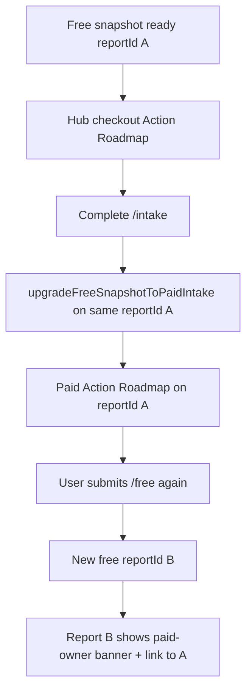

# Report lifecycle and access SOP

**Audience:** Customer support agents and engineers debugging LevelStack report access, free resubmit, and free → paid upgrade tickets.

**Product app:** https://levelstack.levelplaydigital.com (`lpd-levelstack`)

**Customer-facing names** (use these in replies — see [`COPY_BANK.md` §7](../../../lpd-planning/COPY_BANK.md)):

| Customer name | Internal / code |
|---------------|-----------------|
| Visibility Snapshot | `free_snapshot`, plan `levelstack-free-snapshot` |
| Action Roadmap | `full_report` / paid plans (~$97) |
| Action Roadmap + Strategy Call | `strategy_call` / review-call SKU |

**Related:** [Free snapshot workflow](../free-snapshot-workflow.md) · [Upgrade unlock plan](../plans/upgrade-unlock-and-paid-report.md) · [Failed report recovery](../phase-2-1-research.md#failed-report-recovery)

---

## Product policy (refresh with guardrails)

| User state | Behavior |
|------------|----------|
| Free-only, latest snapshot **ready** (within cooldown) | Default: open existing report. Explicit **Run a new snapshot** (`?refresh=1`) creates a new report row. |
| Free-only, latest snapshot **failed** | Allow a new run. |
| Free-only, snapshot **generating** / **pending** | Do **not** create a duplicate job — deep-link to the in-progress report. |
| Paid owner (ready Action Roadmap) | Dual CTA: View Action Roadmap **or** continue with free snapshot (`paid_owner_refresh`). |
| Paid upgrade path | **Same report ID** — free JSON backed up to `free_snapshot_json`; tier flips to paid. |

Do **not** tell customers “you only get one snapshot forever.” They may refresh; the **newest** Visibility Snapshot URL is current. Older links may still open but can be outdated.

---

## Flow A — Free snapshot submit

`POST /api/free-intake` · Form: `/free`



**Key files:** [`app/api/free-intake/route.ts`](../../app/api/free-intake/route.ts) · [`components/free/free-snapshot-form.tsx`](../../components/free/free-snapshot-form.tsx) · [`lib/intake/resolve-free-snapshot-submit-redirect.ts`](../../lib/intake/resolve-free-snapshot-submit-redirect.ts)

**Data notes:**

- Returning free users often **reuse one intake row** (`form_data` overwritten). Historical Visibility Snapshots live as **separate** `levelstack_reports` rows.
- Production **does not** delete prior reports on resubmit. Dev-only `?replace=1` deletes prior intakes (local QA only).

---

## Flow B — Open existing report

`GET /reports/[reportId]`



**Access resolver:** [`lib/reports/get-report.ts`](../../lib/reports/get-report.ts) — `resolveReportAccess`

- Owner session **or** possession cookie (cookie is read even when a different account is signed in).
- Email CTAs use a **30-day** `rtoken` → `/reports/{id}/access` sets HttpOnly cookie.
- Tokens bind **`reportId` + `report_tier`**. After in-place upgrade, an old **free** email link will **not** unlock the paid Action Roadmap.

Snapshot backup after upgrade: `/reports/{id}?view=snapshot` when `free_snapshot_json` is present.

---

## Flow C — Free → paid → optional second free



- Upgrade: [`lib/intake/upgrade-free-snapshot.ts`](../../lib/intake/upgrade-free-snapshot.ts) — same `reportId`, backup free JSON, flip tier, requeue job.
- `/intake` for paid owners with a ready Roadmap: **“You’re all set”** — never force paid intake again because a newer free row is chronologically latest ([`getLatestReadyPaidReportForIntake`](../../lib/reports/get-latest-report-for-intake.ts)).

---

## Ticket triage

| Customer says | Check | Tell customer |
|---------------|-------|---------------|
| “Report not found” | Same email signed in? Link <30 days? Report upgraded? | Sign in with the email used on the form; open the latest report-ready email; if they paid, open the Action Roadmap (not an old free link). |
| “I ran the snapshot twice” | Multiple `levelstack_reports` rows same intake | Newest Visibility Snapshot URL is current; older links may still work but can be outdated. |
| “I paid but still see free / locked sections” | `orders` completed? Paid intake submitted? `report_tier` on the report | Complete intake after checkout; wait until generation finishes; same URL unlocks as Action Roadmap after upgrade. |
| “Paid customer ran free again” | Expected — `paid_owner_refresh` | Action Roadmap is unchanged; the new row is an optional Visibility Snapshot only. |
| “Magic link doesn’t work after I paid” | Tier-bound token vs upgraded row | Sign in with the purchase email, or use the post-upgrade / new report-ready link. Free backup: ask if they need `?view=snapshot`. |
| “Generation failed” | `status = failed`, `error_message`, job metadata | Apologize; escalate for SQL reset / research keys (see failed recovery). No production “Regenerate” for free users. |
| “Which report is mine?” | List reports by `created_at` for user | Prefer newest **ready** paid row if any; else newest **ready** free row. |

---

## Support response templates

### Report not found / link expired

> Thanks for reaching out. Please sign in at levelstack.levelplaydigital.com with the **same email** you used when you ran the Visibility Snapshot. If you used a link from email, open the **most recent** “report ready” message — older links expire after 30 days or stop working after you unlock the Action Roadmap.

### Ran snapshot twice

> You can refresh a Visibility Snapshot. Your **most recent** snapshot is the current one. Older links may still open but can show an earlier version of the research. Use the link from your latest email, or sign in and open your latest report.

### Paid but still free UI

> After purchase, finish the short intake form (about 3 minutes). Your Action Roadmap then generates on the **same report link**. If you already completed intake, wait for the “building your report” screen to finish, then refresh. Reply with the email on the order if it still looks locked.

### Paid owner ran free again

> Running another free Visibility Snapshot does **not** replace your Action Roadmap. Open your Action Roadmap from the banner or your purchase confirmation. The free snapshot is optional extra research.

---

## Debug checklist

1. **Email** → normalize lowercase; find Auth user in Supabase.
2. **`user_id`** → `levelstack_free_entitlements`, `orders` (completed LevelStack plan IDs).
3. **`levelstack_intakes`** → status `submitted`, latest `submitted_at`, inspect `form_data`.
4. **`levelstack_reports`** → order by `created_at` desc; note `id`, `status`, `report_tier`, `plan_id`, `free_snapshot_json` present?, `job_id`.
5. **`levelstack_research_jobs`** → status, `metadata`, `error_message`.
6. **Access** → does owner session match? Is possession cookie/token tier equal to current `report_tier`?

---

## SQL recipes (read-only)

Replace placeholders. Shared Supabase project with hub.

### User id by email

```sql
-- Use Auth admin / Dashboard Users, or:
SELECT id, email, created_at
FROM auth.users
WHERE lower(email) = lower('customer@example.com');
```

### Reports for a user (newest first)

```sql
SELECT id, status, report_tier, plan_id, intake_id, job_id,
       free_snapshot_json IS NOT NULL AS has_free_backup,
       created_at, error_message
FROM levelstack_reports
WHERE user_id = 'USER_UUID'
ORDER BY created_at DESC;
```

### Latest ready paid vs latest free

```sql
-- Ready Action Roadmap
SELECT id, report_tier, created_at
FROM levelstack_reports
WHERE user_id = 'USER_UUID'
  AND status = 'ready'
  AND report_tier IN ('full_report', 'strategy_call')
ORDER BY created_at DESC
LIMIT 1;

-- Newest Visibility Snapshot
SELECT id, report_tier, status, created_at
FROM levelstack_reports
WHERE user_id = 'USER_UUID'
  AND report_tier = 'free_snapshot'
ORDER BY created_at DESC
LIMIT 1;
```

### Entitlement

```sql
SELECT * FROM levelstack_free_entitlements WHERE user_id = 'USER_UUID';

SELECT id, plan_id, status, created_at
FROM orders
WHERE user_id = 'USER_UUID'
  AND status = 'completed'
  AND plan_id LIKE 'levelstack%'
ORDER BY created_at DESC;
```

### Job for a report

```sql
SELECT j.id, j.status, j.error_message, j.metadata, j.created_at
FROM levelstack_reports r
JOIN levelstack_research_jobs j ON j.id = r.job_id
WHERE r.id = 'REPORT_UUID';
```

---

## Escalation

| Situation | Action |
|-----------|--------|
| Failed research after SERP keys fixed | SQL reset + requeue — [phase-2-1-research.md](../phase-2-1-research.md#failed-report-recovery) |
| Local / staging QA | Dev **Regenerate** button or `LEVELSTACK_DEV_REPLACE_SNAPSHOT` — never on production Vercel |
| Wrong email on purchase vs snapshot | Hub account / Stripe vs product Auth — escalate to engineering with both emails |
| Suspected entitlement bug | Capture `orders.plan_id`, `report_tier`, `user_id`; do not manually flip tiers without eng |
| Customer needs PDF / lost account | Sign-in recovery first; reissue report-ready email only after eng confirms path |

**Future (not built):** admin lookup UI email → report list.

---

## Known limitations

| ID | Limitation | Support implication |
|----|------------|---------------------|
| G2 | Multiple free report IDs per intake possible | Point to newest ready free (or paid if present) |
| G3 | Free resubmit overwrites intake `form_data` | Prefill for paid upgrade uses latest intake fields only |
| G4 | Magic link tier-bound after in-place upgrade | Old free `rtoken` will not open paid report |
| G6 | Guardrails: skip duplicate generating jobs; soft reuse ready within cooldown unless `refresh=1` | Customers may need explicit refresh to force a new run |

---

## Key code map

| Concern | Path |
|---------|------|
| Free submit API | `app/api/free-intake/route.ts` |
| Free form UX | `components/free/free-snapshot-form.tsx` |
| Redirect branches | `lib/intake/resolve-free-snapshot-submit-redirect.ts` |
| Report page / banners | `app/reports/[reportId]/page.tsx` |
| Access + token verify | `lib/reports/get-report.ts`, `lib/auth/report-access-token.ts` |
| Cookie exchange | `app/reports/[reportId]/access/route.ts` |
| Free → paid upgrade | `lib/intake/upgrade-free-snapshot.ts` |
| Paid intake gate | `app/api/intake/route.ts`, `app/intake/page.tsx` |
| Latest report helpers | `lib/reports/get-latest-report-for-intake.ts` |
| Paid-owner free chrome | `lib/reports/paid-owner-report-chrome.ts` |
