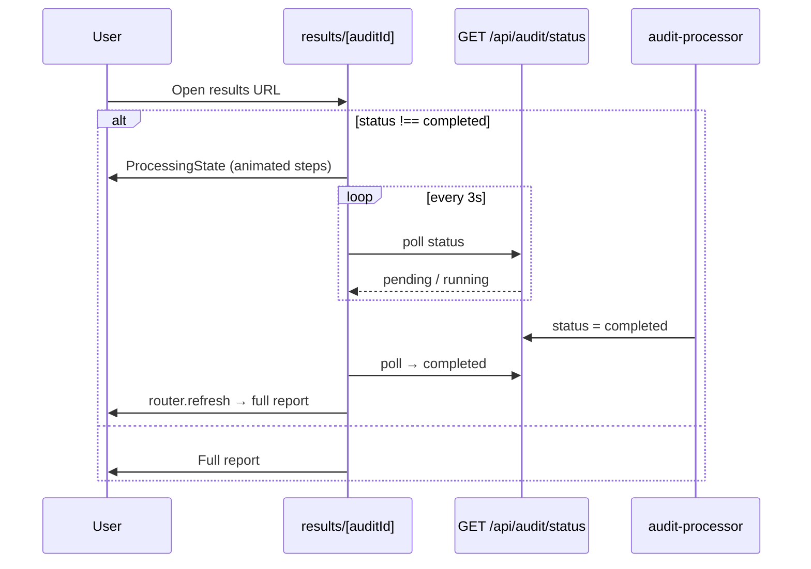
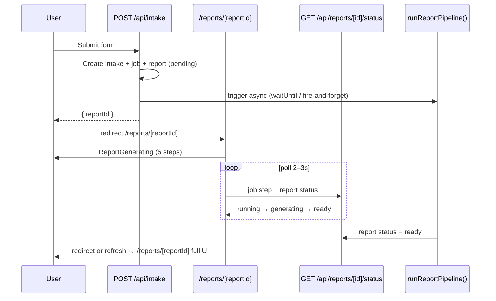

# Phase 2 — Instant report generation with on-screen progress

**Status:** 2.0 done; **2.1 implemented** (multi-provider SERP + OpenAI synthesis). See `docs/phase-2-1-research.md`.  
**Reference UX:** [`seo-foundation-audit`](../../../seo-foundation-audit) — `ProcessingState` + `/results/[auditId]` polling  
**Product brief:** §10.2 (pipeline), §10.3 (report UI), §21 Phase 2–3, §0.5 (public copy)

---

## Goal

After intake submit, the user should **immediately** land on a live progress screen (not a static “we’ll email you” card), then **automatically** see the full report when generation finishes — same mental model as SEO Foundation `/results/[auditId]`.

**“Instant” means:**

- **Instant feedback** — progress UI within ~1s of submit  
- **Fast as possible generation** — optimize pipeline; full six-section research + LLM may still take **minutes** in v1  
- **Not** blocking the HTTP request until the report is done (Vercel serverless timeout ~60s would fail)

---

## Current state (Phase 1)

| Step | Today |
|------|--------|
| Submit intake | `POST /api/intake` → rows in `levelstack_intakes`, `levelstack_research_jobs` (`pending`), `levelstack_reports` (`pending`) |
| Redirect | `/intake/complete` — static message, no progress |
| Pipeline | **Not implemented** — job never runs |
| Report UI | **Not built** — §21 Phase 3 |

---

## Reference: SEO Foundation pattern



**Files to study / adapt:**

| SEO Foundation | Role |
|----------------|------|
| `components/report/processing-state.tsx` | Step list, timer, poll until complete, `router.refresh()` |
| `app/(marketing)/results/[auditId]/page.tsx` | Renders `ProcessingState` vs report by `audit.status` |
| `lib/audit-processor.ts` | `onProgress(percent)` → job metadata |
| `app/api/audit/status` (or foundation `check-status`) | Poll endpoint |

---

## Target LevelStack flow



**Route map (new / changed):**

| Route | Purpose |
|-------|---------|
| `POST /api/intake` | Return `{ reportId, jobId }`; trigger pipeline (no long wait) |
| `/reports/[reportId]` | Server: if `pending`/`generating` → client progress; if `ready` → report (Phase 3 UI) |
| `GET /api/reports/[reportId]/status` | `{ reportStatus, jobStatus, step, progress, error }` |
| `POST /api/reports/[reportId]/run` | Optional: idempotent (re)start job if stuck |

**Deprecate / replace:** `/intake/complete` → redirect to `/reports/[reportId]` after submit.

---

## Progress UI spec (SEO-style, LevelStack content)

Six steps aligned with §10.2 / §20 (not SEO’s eight modules):

1. Search footprint review  
2. Online reputation review  
3. Digital presence gap analysis  
4. Revenue funnel diagnosis  
5. Competitive context snapshot  
6. Prioritized action plan (+ executive summary synthesis)

**UI components (new):**

- `components/report/report-generating.tsx` — port pattern from `processing-state.tsx`:
  - Icons + labels per step  
  - Highlight current step (from API `metadata.currentStep` when available; else time-based fallback like SEO)  
  - Elapsed timer; soft message after ~2 min (per brief: no **guaranteed** public SLA)  
  - Poll `GET /api/reports/[id]/status` every 2–3s  
  - On `report.status === 'ready'` → `router.replace(/reports/[id])` or `router.refresh()`  
- Reuse shadcn `Card`, LPD tokens from sample HTML (`#090E18`, severity colors)

**Job `metadata` shape (store on `levelstack_research_jobs.metadata`):**

```json
{
  "currentStep": "search_footprint",
  "progress": 42,
  "stepsCompleted": ["search_footprint"],
  "plan_id": "levelstack-standard"
}
```

---

## Pipeline architecture (Phase 2)

### ADRs to write first (§9.7)

| ADR | Decision |
|-----|----------|
| **002 — Job orchestration** | **Recommended v1:** `after()` / `waitUntil` from intake API + same process runner; **later:** Vercel Workflow or edge cron for retries |
| **003 — Research APIs** | Multi-provider SERP chain + cache (ADR 003) — SerpAPI, SearchAPI, DataForSEO |
| **004 — PDF** | Defer to Phase 3; web report first |

### Runner modules (`lib/pipeline/`)

| Module | Responsibility |
|--------|----------------|
| `run-report-pipeline.ts` | Orchestrator: load intake → run steps → synthesis → save `report_json` |
| `steps/search-footprint.ts` | §10.2.1 |
| `steps/reputation.ts` | §10.2.2 |
| … | One file per section |
| `synthesis/executive-summary.ts` | §10.3.2 — after all sections |
| `synthesis/section-synthesis.ts` | LLM → finding cards JSON schema |
| `types/report-json.ts` | Zod schema for `levelstack_reports.report_json` |

**Status transitions:**

```
levelstack_research_jobs: pending → running → completed | failed
levelstack_reports:       pending → generating → ready | failed
```

**On failure:** Set `failed` + `error_message`; progress UI shows error + support link (do not block entire product per §10.2).

### “Instant” MVP shortcut (Phase 2.0 — optional first PR)

Ship **progress UX + stub pipeline** before all APIs:

1. Runner sleeps / mock findings per step with real `metadata` updates  
2. User sees full flow end-to-end in &lt;30s dev  
3. Swap stub for real research in 2.1 without changing UI contract  

Validates UX before live SERP/LLM cost and complexity.

---

## Implementation phases (recommended order)

### Phase 2.0 — Progress shell (1–2 days)

- [ ] `GET /api/reports/[id]/status`  
- [ ] `components/report/report-generating.tsx`  
- [ ] `/reports/[reportId]/page.tsx` (progress only; placeholder when `ready`)  
- [ ] Intake form redirect → `/reports/[reportId]`  
- [ ] Stub runner: mark steps in metadata, set `report_json` minimal fixture, `status = ready`  
- [ ] Trigger runner from `POST /api/intake` via `after()`  

**Exit criteria:** Submit intake → progress animates → lands on placeholder “Report ready” page.

### Phase 2.1 — Real research + synthesis (core Phase 2)

- [ ] ADR 002–003  
- [ ] Implement research steps per §10.2  
- [ ] Structured `report_json` matching §10.2–10.3.5  
- [ ] Validate output against `assets/levelstack-sample-report.html` structure  
- [ ] Env: ≥1 SERP provider (`SERPAPI_KEY`, `SEARCHAPI_KEY`, and/or DataForSEO), `OPENAI_API_KEY` / `ANTHROPIC_API_KEY`  

**Exit criteria:** One real intake produces non-mock `report_json` stored in Supabase.

### Phase 2.2 — Reliability

- [ ] Idempotent job start (no duplicate runs)  
- [ ] Timeout per step; partial report with limitations noted (§10.2)  
- [ ] Logging / observability (step failures in `metadata`)  

### Phase 3 — Full report UI (can overlap tail of 2.1)

- [ ] Executive summary + SEO-style dashboard + six tabs (§10.3, sample HTML)  
- [ ] `/reports/[reportId]` renders full report when `ready`  
- [ ] PDF + report-ready email (§21 Phase 3)  

---

## Copy & compliance (§0.5)

| Do | Don’t |
|----|--------|
| “Generating your report…” | “Ready in 48 hours” |
| “This usually takes a few minutes” (soft) | Guaranteed clock time |
| Show step names | Promise exact minute count |

---

## Env vars (additions)

| Variable | Purpose |
|----------|---------|
| `OPENAI_API_KEY` / `ANTHROPIC_API_KEY` | Synthesis |
| `SERPAPI_KEY` / `SEARCHAPI_KEY` / DataForSEO / `FIRECRAWL_API_KEY` | Research (per ADR 003) |
| `LEVELSTACK_PIPELINE_MAX_DURATION_MS` | Optional safety cap |

---

## Testing

| Test | Type |
|------|------|
| Intake → redirect includes `reportId` | API unit |
| Status API returns step progression | API unit |
| Stub pipeline → `ready` within N seconds | Integration (dev) |
| Poll → refresh shows report | Manual E2E (update `docs/phase-1-e2e-test.md`) |

---

## What we are **not** doing in Phase 2.0

- PDF export  
- Hub changes (except optional “View report” link later)  
- Post-purchase $197 add-on  
- Parallel monorepo with SEO audit code — **copy patterns**, don’t import repo  

---

## Decision for you

| Option | Tradeoff |
|--------|----------|
| **A — 2.0 then 2.1** (recommended) | See progress this week; real data next |
| **B — Full 2.1 before any UI** | Longer wait; one big PR |
| **C — 2.0 stub only for demo** | Fastest demo; no real report until 2.1 |

**Recommendation:** **Option A** — matches your ask (“instant” UX now, real report ASAP after).

---

## Next action

When you approve, implementation starts with **Phase 2.0**:

1. Change intake success redirect to `/reports/[reportId]`  
2. Add `ReportGenerating` + status API + stub pipeline  

Say **“implement Phase 2.0”** or **“implement full Phase 2”** if you want to skip the stub.
