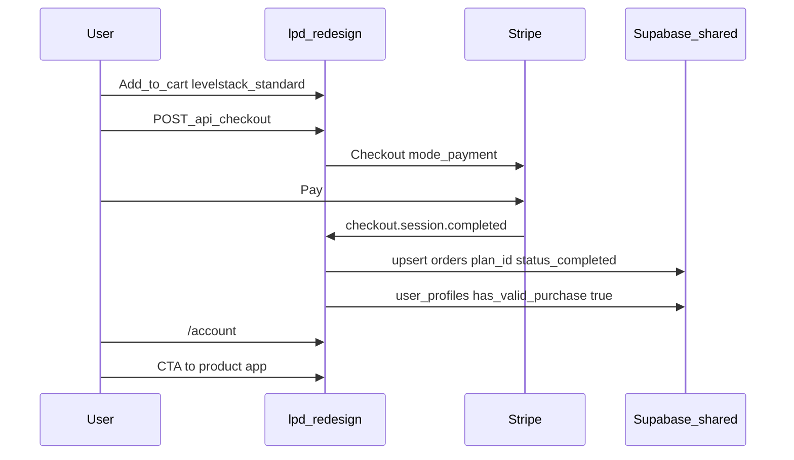
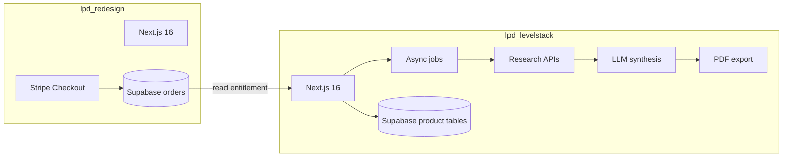

# LevelStack — Project Brief & PRD (Merged)

**Product line:** LPD Audit Reports  
**Product:** LevelStack  
**Status:** Live (marketing + checkout on hub); product runtime in separate repo (to build)  
**Document version:** 1.3  
**Last updated:** June 2026  
**Owner:** Level Play Digital  

**Canonical location:** Copy this file to `docs/project-brief.md` in the LevelStack product repository when scaffolded. Until then, this copy in `lpd-redesign` is the source of truth.

**Merged from:**

- Product page: [`app/platform/levelstack`](../../../app/platform/levelstack/page.tsx), [`components/platform/levelstack-sections.tsx`](../../../components/platform/levelstack-sections.tsx)
- Messaging: [`docs/product/copy-brief.md`](../copy-brief.md) § LevelStack
- Commerce (hub): ADR [003](../../architecture/decisions/003-levelstack-cart-and-valid-plans.md), [`docs/workflows/checkout.md`](../../workflows/checkout.md)
- PRD draft (internal, June 2026)

---

## 0. Architecture decisions (locked)

These decisions govern repo split, purchase flow, and what each codebase may build. **Do not contradict without a new ADR and updates to both repos.**

### 0.1 Repo split

| System | Repository | Deploy | Owns |
|--------|------------|--------|------|
| **Commercial hub** | `lpd-redesign` | `levelplaydigital.com` | Marketing `/platform/levelstack`, cart, Stripe Checkout, webhook → `orders`, `/account` billing summary |
| **LevelStack product app** | `lpd-levelstack` | `levelstack.levelplaydigital.com` | Intake, free snapshot, research pipeline, report UI, PDF, review-call fulfillment, product-owned Supabase tables |

**Technology stack:** §9.

### 0.2 Codebase independence vs purchase integration

| Principle | Decision |
|-----------|----------|
| **No code dependency on marketing site** | Product repo must not import hub code or deploy as part of `lpd-redesign`. Separate deploy, separate codebase. |
| **Purchase path stays on hub** | Cart and Stripe checkout remain on the commercial hub. Product app must **not** implement parallel checkout for the same SKUs in v1. |
| **Entitlement integration** | Product app **reads** purchase state from shared Supabase (`orders` written by hub webhook). Hub `orders` is source of truth for “did they pay?” |
| **Sellable product unit** | Product runtime is independently deployable for delivery; acquisition story assumes delivery app + hub commerce can be separated later with a documented contract. |

### 0.3 What is *not* a dependency

- Product repo does not require the marketing Next.js app to be running to serve reports (after purchase is recorded).
- Product repo does not duplicate hub cart, hybrid pricing, or hub admin CMS.
- Optional one-way link from hub marketing page to product app is **referral**, not a runtime API dependency.

### 0.4 Canonical plan IDs (must not diverge)

| Plan ID | Price | Includes |
|---------|-------|----------|
| `levelstack-standard` | $497 one-time | Full six-section report, web + PDF |
| `levelstack-review-call` | $694 one-time | Everything in Standard + 30-minute review call |

Defined in hub [`data/levelstackPlans.ts`](../../../data/levelstackPlans.ts), registered in [`lib/valid-plans.ts`](../../../lib/valid-plans.ts).

**v1.0 checkout rule:** Both tiers are selected at hub checkout only. Post-purchase $197 review-call add-on (per early PRD draft) is **deferred** — not in scope until explicitly approved.

### 0.5 Customer-facing delivery timing vs internal SLA

| Audience | Rule |
|----------|------|
| **Public marketing & product UI copy** | Report generates when intake is complete. **Never** promise a fixed public duration (e.g. “48 hours”). Per [`copy-brief.md`](../copy-brief.md). |
| **In-product status copy** | May show progress (“generating your report”) without guaranteeing a clock time until pipeline p95 is measured. |
| **Internal operations (v1.0 target)** | ≤ 60 minutes from intake submission to report available (p95 to be validated). |

### 0.6 ICP and copy authority

| Topic | Authority |
|-------|-----------|
| Customer-facing messaging | [`docs/product/copy-brief.md`](../copy-brief.md) § LevelStack |
| Business size for LevelStack | **1–20 employees** (copy brief). Do not apply Automator Pro’s 10-client network disqualifier on LevelStack pages. |
| PRD draft “1–10 employees” | Superseded by copy brief for external copy; internal targeting may use 1–20. |

### 0.7 Promotions and pricing

| Topic | Decision |
|-------|----------|
| List prices | Fixed: $497 / $694 at hub `#pricing` |
| Hub cart promo codes | Hub supports promo codes globally today. **Open:** whether LevelStack SKUs are excluded from promos (PRD draft said no coupons in v1.0). Resolve before scaling paid acquisition. |

### 0.8 Sample report (reference implementation)

**Canonical UI reference:** [`assets/levelstack-executive-summary-v2.png`](../assets/levelstack-executive-summary-v2.png) — v2 report layout. [`assets/levelstack-sample-report.html`](../assets/levelstack-sample-report.html) — copy tone only (legacy v1 layout).

**Layout reference (scores & summary):** [SEO audit results page](https://seo.levelplaydigital.com/results/cmpxhp9uf0000fw1qynk3qz65) on `seo.levelplaydigital.com` — overall score hero, category breakdown, issue priority counts, executive problem framing.

Engineering and synthesis prompts must match **structure, tone, and depth** of the sample HTML. PDF export must preserve the same information hierarchy.

---

## 1. Purpose of this document

This document is the single source of truth for LevelStack **product behavior**, **engineering scope**, **technology stack**, and **hub integration**. It defines problem, users, features, flows, system behavior, metrics, constraints, gaps, and open questions.

**Audience:** Engineering, design, and ops on the LevelStack product repo and commercial hub.

**Not a substitute for:** [`copy-brief.md`](../copy-brief.md) (customer-facing messaging).

---

## 2. Product summary

**LevelStack** is a one-time, AI-assisted digital audit report that shows a business owner what prospects find when they search for them online — before they decide to engage. It combines automated web research with intake-provided business context to produce a six-section, prioritized report covering search visibility, online reputation, digital presence, revenue funnel structure, and competitive positioning.

| Attribute | Value |
|-----------|--------|
| **Price** | $497 Standard \| $694 with optional 30-minute review call |
| **Delivery** | In-account web report + branded PDF download (product app) |
| **Human involvement** | Zero for Standard tier; optional review call on `$694` tier only |
| **Subscription** | None |

---

## 3. Strategic context

### 3.1 Product line distinction

LevelStack is **not** Automator Pro. It is **LPD Audit Reports** — one-time diagnostics for individual business owners and personal brands, not subscription tools for operators managing client networks.

### 3.2 Funnel role

```
LevelStack (one-time audit) → surfaces specific gaps →
  SEO Automator Pro (ongoing monitoring + resolution, launching soon)
```

Upsell is structural: report links to hub `/platform/seo` waitlist with **conditional** copy tied to findings.

### 3.3 Standalone value

The $497 tier must stand alone. SEO Automator Pro is additive, not required to complete the audit value.

---

## 4. Problem statement

Most small business owners, coaches, consultants, and service professionals have not reviewed their digital presence since setup. They invest in outbound (ads, referrals, events) without knowing what prospects find in the first seconds of search — often the real conversion variable.

LevelStack exposes the gap between what operators *think* prospects find and what prospects *actually* find (including prior business names, reputation artifacts, and AI search summaries).

---

## 5. Target user

### 5.1 Primary buyer profile

- **Business size:** Solo or small team (**1–20 employees** per copy brief)
- **Spend signal:** Ads, events, referrals — conversion lower than expected
- **Audit history:** No formal digital presence review in 12+ months (often 24+)
- **Types:** Coach, speaker, educator, consultant, RE, contractor, healthcare/legal professional, personal brand

### 5.2 Qualifying scenarios

- Coach: Meta ads get clicks, low registrations; assumes targeting — may be trust gap in SERPs
- RE agent: Old complaint still on page one for personal name
- Consultant: Rebrand 18 months ago; old name still ranks
- SMB: GBP claimed but stale; weak reviews
- Event promoter: No AI search visibility when prospects research after events

### 5.3 Explicit disqualification

- Operators needing **network-level** monitoring (10+ clients) → SEO Automator Pro ICP, not LevelStack
- Audited in last **90 days** with current action list
- Seeking **implementation** — LevelStack diagnoses only
- No public digital presence and no intent to build one

---

## 6. Goals

### 6.1 Product goals

| Goal | Metric | Target |
|------|--------|--------|
| Surfaces ≥1 unknown finding | Post-report survey | ≥ 80% yes |
| Standard tier fully automated | Manual interventions per report | 0 |
| SEO Automator waitlist engagement | CTA click from report | ≥ 25% |
| Satisfaction | NPS | ≥ 40 |
| Referrals | Referred purchase within 60 days | ≥ 15% |

### 6.2 Business goals

- Establish LPD Audit Reports as a repeatable one-time revenue line
- Warm pipeline for SEO Automator Pro pre-launch
- Broader ICP than mid-market Automator Pro operators
- Proof-of-concept non-subscription revenue ahead of potential product-unit exit

---

## 7. Scope

### 7.1 In scope — commercial hub (`lpd-redesign`)

- Marketing page `/platform/levelstack`
- Add to Cart → `/cart` → Stripe Checkout (`mode: payment`)
- Plan IDs `levelstack-standard`, `levelstack-review-call`
- Webhook → `orders`, `has_valid_purchase`
- `/account` order history + **CTA deep link to product app** (hub build item)
- Supabase auth at purchase (sign-in required for cart/checkout today)

### 7.2 In scope — product app (new repo)

- Entitlement gate (read hub `orders`)
- Intake questionnaire (product domain)
- Automated research pipeline on intake submit
- Six-section report generation + synthesis layer
- Web report + branded PDF
- Review-call workflow for `levelstack-review-call` tier
- SEO Automator upsell modules in report (links to hub)
- Report-ready notification email (product-owned)

### 7.3 Out of scope (v1.0)

- Implementation / remediation services
- Ongoing monitoring (SEO Automator Pro)
- Custom research outside six sections
- Multi-location / network audits
- White-label / reseller / API access / multi-seat
- **Product-app Stripe checkout** for LevelStack SKUs
- Post-purchase-only review-call SKU ($197 add-on) — deferred

---

## 8. Integration contract with the commercial hub

**Contract version:** 1.0  
**Applies to:** Hub release with LevelStack cart (ADR-003) + LevelStack product app v1

### 8.1 Purpose

LevelStack is **sold on the hub** and **delivered in the product app**. This contract is the only supported boundary between them.

### 8.2 Purchase flow (hub-only)



- Sole checkout path: hub [`app/api/checkout/route.ts`](../../../app/api/checkout/route.ts), catalog via [`lib/stripe-catalog.ts`](../../../lib/stripe-catalog.ts).
- Webhook: [`app/api/webhook/route.ts`](../../../app/api/webhook/route.ts) → [`syncOrderToSupabase`](../../../lib/stripe-customer.ts) sets `orders.plan_id` from session `metadata.planId`.
- Product app **must not** register a second Stripe webhook for the same SKUs in v1.

### 8.3 Entitlement (product reads, hub writes)

User may access product `/intake` and reports when:

- Authenticated Supabase user, and
- Exists `orders` row: `user_id` = user, `status` = `completed`, `plan_id` ∈ `{ levelstack-standard, levelstack-review-call }`

Implement `hasLevelStackAccess(supabase, userId)` mirroring [`lib/workflow-access.ts`](../../../lib/workflow-access.ts).

- **`levelstack-review-call`:** enable review-call scheduling after report ready.
- **Admin bypass:** optional, align with hub `canBypassIntakeGate` for previews.
- **Do not** call Stripe from product app to verify payment in v1.

### 8.4 Authentication

- **Shared Supabase project** — same `auth.users` / `user_profiles`.
- Cross-domain session: users sign in on product origin; free snapshot uses magic-link email (`/auth/callback` → report). See [ADR 001](./adr/001-auth-handoff.md).

### 8.5 Data ownership

| Data | Writer | Reader |
|------|--------|--------|
| `orders`, `user_profiles.has_valid_purchase` | Hub webhook | Hub + product (entitlement) |
| Intakes, research jobs, report JSON, PDF blobs | Product app | Product app |
| Stripe Customer / PaymentIntent | Hub checkout | Hub |

Suggested product tables (names TBD): `levelstack_intakes`, `levelstack_research_jobs`, `levelstack_reports`.

### 8.6 URLs and handoffs

| Step | Owner | Path |
|------|-------|------|
| Marketing | Hub | `/platform/levelstack` |
| Purchase | Hub | `/cart` → Stripe → `/checkout/success` → `/account` |
| Intake | Product | `/intake` |
| Report | Product | `/reports/{id}` |
| PDF | Product | `/reports/{id}/pdf` |

**Hub env:** `NEXT_PUBLIC_LEVELSTACK_APP_URL`  
**Product env:** `NEXT_PUBLIC_HUB_URL` (upsell links, “purchase required” redirect to `/platform/levelstack#pricing`)

### 8.7 Notifications

| Event | Owner |
|-------|-------|
| Order / payment confirmation | Hub (existing) |
| Report ready | Product app |
| Review call scheduling | Product app or ops |

### 8.8 Forbidden without ADR + coordinated PRs

- New LevelStack `plan_id` on one repo only
- Product-app checkout for same SKUs
- Duplicate webhook writing `orders`
- Hub storing or generating full report bodies

---

## 9. Technology stack

Stack split matches §0.1: **hub sells**, **product delivers**. Product repo must not import hub code; it may share Supabase and org conventions.

### 9.1 Stack at a glance



### 9.2 Commercial hub stack (reference only — shipped)

See [`docs/architecture/overview.md`](../../architecture/overview.md). LevelStack **consumes** this; it does not rebuild it in the product repo.

| Layer | Technology | LevelStack role |
|-------|------------|-----------------|
| Framework | Next.js 16 App Router, React 19, TypeScript strict | Marketing + cart only |
| Styling | Tailwind CSS v4, shadcn/ui | `/platform/levelstack` |
| Hosting | Vercel | `levelplaydigital.com` |
| Auth / DB | Supabase (`user_profiles`, `orders`, …) | Writes purchase; shared auth |
| Payments | Stripe Checkout + webhook | Sole purchase path (§8) |
| Email | Resend | Order confirmation (existing) |

Hub references: [`env.mjs`](../../../env.mjs), [`lib/supabase/`](../../../lib/supabase/), [`app/api/webhook/route.ts`](../../../app/api/webhook/route.ts), ADR [003](../../architecture/decisions/003-levelstack-cart-and-valid-plans.md).

### 9.3 LevelStack product app stack (v1 — build in new repo)

| Layer | Choice | Notes |
|-------|--------|-------|
| **Runtime / framework** | Next.js 16 (App Router), React 19, TypeScript strict | Match hub; separate Vercel project |
| **Package manager** | pnpm | Same as hub |
| **Styling / UI** | Tailwind CSS v4, shadcn/ui, LPD design tokens | Report UI per §10.3; sample HTML + SEO results dashboard; reuse [`scripts/build-design-tokens.mjs`](../../../scripts/build-design-tokens.mjs) pattern or copy tokens |
| **Forms** | react-hook-form + zod | Intake questionnaire (§10.1) |
| **Hosting** | Vercel | `levelstack.levelplaydigital.com` |
| **Database** | Supabase PostgreSQL (shared project) | New tables: intakes, research_jobs, reports; RLS by `user_id` |
| **Auth** | `@supabase/ssr` | Same `auth.users` as hub; cross-domain session = open question (§18) |
| **Entitlement** | Supabase read on hub `orders` | `hasLevelStackAccess()` — **no Stripe SDK in product v1** |
| **Background work** | Vercel Functions + async job table **or** Vercel Workflow (TBD ADR) | Research after intake; internal SLA ≤ 60 min |
| **Research inputs** | External APIs (vendor TBD §18) | Serp/search, site crawl, PageSpeed/Lighthouse, reputation sources |
| **Synthesis** | LLM API (OpenAI and/or Anthropic) | Hub uses `OPENAI_API_KEY` in [`env.mjs`](../../../env.mjs); product owns prompts + structured JSON |
| **PDF** | HTML report → PDF (Playwright or `@react-pdf/renderer` — product ADR) | Must match web report (§10.3) |
| **File storage** | Supabase Storage | PDF + optional artifacts; private bucket; signed URLs |
| **Transactional email** | Resend | “Report ready” notification |
| **Env validation** | `@t3-oss/env-nextjs` + zod | Mirror hub [`env.mjs`](../../../env.mjs) |
| **Testing** | Vitest (unit), Playwright (e2e) | Entitlement, intake submit, report view smoke |
| **CI** | GitHub Actions | `type-check`, `lint`, `test:unit` (match hub scripts) |
| **Observability** | Vercel Analytics / logs; optional `@vercel/otel` | Log per research source failures |

**Explicitly out of product v1 stack:**

- Stripe Checkout / webhooks (hub only)
- Hub cart, `valid-plans`, hybrid pricing, admin CMS
- GoHighLevel on public product pages (review-call may use ops booking backend-side)

### 9.4 Shared vs product-owned Supabase

| Resource | Owner |
|----------|--------|
| `auth.users`, `user_profiles`, `orders` | Hub writes; product reads for entitlement |
| `levelstack_*` tables, Storage buckets | Product migrations in new repo |
| Service role key | Product server/workers only; never client |

Suggested tables: `levelstack_intakes`, `levelstack_research_jobs`, `levelstack_reports`.

### 9.5 Environment variables (product app)

| Variable | Purpose |
|----------|---------|
| `NEXT_PUBLIC_SUPABASE_URL`, `NEXT_PUBLIC_SUPABASE_ANON_KEY` | Auth + RLS client |
| `SUPABASE_SERVICE_ROLE_KEY` | Jobs, admin writes |
| `NEXT_PUBLIC_APP_URL` | Product app base URL (`https://levelstack.levelplaydigital.com` in production) |
| `NEXT_PUBLIC_HUB_URL` | Upsell + “purchase required” → `/platform/levelstack#pricing` |
| `RESEND_API_KEY`, `FROM_EMAIL`, `FROM_NAME` | Free-snapshot magic link + report-ready email |
| `OPENAI_API_KEY` and/or `ANTHROPIC_API_KEY` | Synthesis |
| `SERPAPI_KEY`, `FIRECRAWL_API_KEY`, etc. | Research pipeline |

**No `STRIPE_*` in product v1.** Hub env adds `NEXT_PUBLIC_LEVELSTACK_APP_URL` (`https://levelstack.levelplaydigital.com` in production) for account and checkout CTAs.

### 9.6 Patterns to copy from hub (not the whole app)

When bootstrapping `lpd-levelstack`, copy **patterns** only:

- [`lib/supabase/client.ts`](../../../lib/supabase/client.ts), [`server.ts`](../../../lib/supabase/server.ts), [`admin.ts`](../../../lib/supabase/admin.ts)
- [`env.mjs`](../../../env.mjs) structure
- ESLint / Prettier / `tsconfig.json` (`strict`, `noUncheckedIndexedAccess`)
- Trimmed [`CLAUDE.md`](../../../CLAUDE.md) / [`.cursorrules`](../../../.cursorrules) for product app

Do **not** copy cart, checkout, marketing pages, or admin CMS.

### 9.7 Product-repo ADRs (before implementation)

Record in the product repo:

1. Cross-domain Supabase auth (hub → product handoff)
2. Research API vendor selection
3. PDF generation approach
4. Job orchestration (cron vs queue vs Vercel Workflow)

See §18 open questions.

---

## 10. Product features

### 10.1 Intake questionnaire

**Trigger:** After hub purchase; user arrives via hub `/account` CTA → product `/intake` (entitlement gate).

**Format:** In-product, 10–15 minutes, all required fields.

| Field | Purpose |
|-------|---------|
| Primary business name | Search anchor |
| All prior business names / brands / DBAs | Prior-entity reputation sweep |
| Owner / personal brand name | Name-specific SERP |
| Primary service or offer | Competitive + funnel context |
| Current price point | Funnel + positioning |
| Active ad spend (Y/N, platform, ~budget) | Funnel readiness |
| Website URL | Presence + funnel |
| Social profiles (all active) | Footprint assessment |
| Email list size (approx.) | Funnel signal |
| Geographic market (local / regional / national) | Search scoping |
| Awareness of complaints, press, disputes | Directed research |
| Self-assessment of reputation (scale + text) | Perceived vs actual gap |
| What prompted purchase (open text) | Qualitative context |

**Validation:** All required; website HTTP reachable; multi-entry prior names; geo drives local scoping.

**Post-submit:** Research pipeline starts automatically; in-product confirmation (no manual queue). Internal SLA ≤ 60 minutes; public copy per §0.5.

### 10.2 Automated research pipeline

Zero manual intervention for Standard tier. Per-section scope:

1. **Search footprint** — Google page 1 (business, owner, service+location); prior names; AI preview (ChatGPT, Perplexity, Google AI Overview) with AISO/AEO/GEO signals where evidence exists.
2. **Online reputation** — GBP reviews; unclaimed profiles (Yelp, BBB, Trustpilot, vertical-specific); complaint boards; prior-name sweeps.
3. **Digital presence** — GBP completeness; social vs stated experience; website Lighthouse/mobile, SSL, CTA, trust signals, messaging clarity.
4. **Revenue funnel** — Offer/price vs positioning; ad-to-landing readiness; break points; list size vs offer.
5. **Competitive context** — Top 3 competitors; comparative signals; one strength, one weakness, one differentiation gap; date-stamped.
6. **Action plan** — Compiled findings ranked by cost, speed, revenue relevance; this week / month / quarter; owner vs freelancer tasks; time estimates.

**Failures:** Log inaccessible sources; note limitation in section; do not block entire report.

**Synthesis:** No raw dumps; AI synthesis layer required.

### 10.3 Report delivery — final output specification

The LevelStack report visual reference is **`assets/levelstack-executive-summary-v2.png`** (header: `assets/levelstack-report-header-v2.png`). Implementation: `styles/report-final-design.css`, `components/report/report-header.tsx`, `components/report/executive-summary-v2.tsx`.

[`assets/levelstack-sample-report.html`](assets/levelstack-sample-report.html) is **legacy v1** — use for **copy tone / finding depth only**, not layout or header structure.

Both web view and PDF must present the same content. PDF is a permanent download (no 30-day expiry like the free SEO tool).

#### 10.3.1 Page structure (top → bottom)

| Block | Purpose | Reference |
|-------|---------|-----------|
| **Report header** | Title + assessment subtitle; score + grade boxes; stacked meta columns + stat pills | `levelstack-report-header-v2.png` |
| **Executive summary** | 2–4 paragraphs synthesizing cross-section findings, business impact, and top priority — for a non-technical owner | Required addition (see §10.3.2) |
| **Summary dashboard** | Overall LevelStack score/grade, total issues, priority breakdown, six section score cards, biggest problem areas | SEO audit results page pattern |
| **Section tabs** | Seven tabs on white bar (Executive summary default); orange active underline | v2 screenshot |
| **Section panels** | One active panel per tab; findings + section-specific modules | v2 + sample HTML tone for finding copy |
| **Report footer** | LevelStack · Level Play Digital attribution; generation date | Sample HTML `.report-footer` |

#### 10.3.2 Executive summary (required)

Generated by the synthesis layer **after** all research completes. Must include:

- **What prospects likely see today** when they search the buyer’s name, business, or primary offer (one plain-language paragraph).
- **Biggest trust or conversion risk** — single clearest issue (analogous to “Your Most Critical Issue” on the SEO audit page).
- **Perceived vs actual gap** where intake self-assessment diverges from research (when applicable).
- **What to do first** — pointer to Action plan “this week” items (not the full list).
- **Scope note** — diagnostic only; buyer executes fixes.

Tone: observational, specific to this business — no boilerplate. Never guarantee revenue or ranking outcomes.

#### 10.3.3 Summary dashboard (SEO-audit-style)

Adapt the [SEO audit results](https://seo.levelplaydigital.com/results/cmpxhp9uf0000fw1qynk3qz65) hero and category breakdown for LevelStack’s six sections:

| Dashboard element | LevelStack mapping |
|-------------------|-------------------|
| Overall score (e.g. 63/100, letter grade) | **LevelStack readiness score** — composite from section severities (algorithm TBD; explainable in report) |
| Issues found (total count) | Total findings across all sections |
| Priority breakdown | Count of findings tagged critical / high / medium / low |
| Category breakdown (N/100 per row) | **One score per section** (Search, Reputation, Presence, Funnel, Competitive, Action plan readiness) |
| Biggest problem areas | Top 2–3 sections by lowest score or most critical findings |
| Traffic / conversion signal | Optional **Funnel readiness %** when intake includes ad spend + website (see sample Section 4) |

**Visual tokens (align both references):**

- Dark header: `#002147` (`--lpd-dark`) — flat, no hero mesh
- Report accents: `--rpt-blue` `#5BC0DE`, `--rpt-orange` `#F0AD4E` (header/subtitle/grade). Hub `#00D4F5` / `#FF6633` for marketing CTAs only
- Severity: red `#E24B4A`, amber `#EF9F27`, green `#639922` — dots, badges, score bars

Reuse LPD design tokens from hub where possible (`scripts/build-design-tokens.mjs`).

#### 10.3.4 Section panels (sample HTML pattern)

| Section | Tab label | Panel contents |
|---------|-----------|----------------|
| 1 | Search footprint | Status badge; finding cards; **AI row** (ChatGPT, Perplexity, Google AI Overview) with “as of [date]”; conditional upsell strip |
| 2 | Reputation | Finding cards; profile grid; prior-name sweep |
| 3 | Digital presence | GBP score rows + bars; social vs experience; website trust + Lighthouse mobile |
| 4 | Revenue funnel | Funnel readiness badge; ad spend vs landing; offer/price; email list |
| 5 | Competitive context | Comparison grid (You vs top 3); strength card; differentiation gap; date-stamped |
| 6 | Action plan | This week / month / quarter groups; columns: #, Action (+ subtext), Who, Time; closing upsell strip |

**Finding card schema:** `label` · `value` (headline) · `detail` (2–4 sentences) · `severity` (`critical` \| `attention` \| `good`).

#### 10.3.5 Analysis layer

Raw research is never shown. Synthesis produces executive summary, all finding cards, competitive interpretation, and action items derived **only** from documented findings. Use “as of [report date]” on time-sensitive data.

#### 10.3.6 Upsell modules

Per sample `.upsell-strip` and §10.6: Sections 1–3 and 6 + PDF footer; conditional copy; link to hub `/platform/seo` waitlist.

#### 10.3.7 PDF export

Executive summary + summary dashboard + all six sections; action plan as **formatted table**; shareable; indefinite retention.

#### 10.3.8 Responsive behavior

Horizontal scroll tabs on mobile; grids collapse or scroll; PDF may layout differently but same content.

#### 10.3.9 Sample vs production

Internal/marketing samples use `Sample Report` badge (`.sample-badge`). Paid reports use live meta counts only.

Layout reference: [`assets/levelstack-executive-summary-v2.png`](../assets/levelstack-executive-summary-v2.png). Copy tone: [`assets/levelstack-sample-report.html`](../assets/levelstack-sample-report.html).

### 10.4 Review call add-on (`levelstack-review-call` only)

- **Purchase:** Hub checkout tier $694 only (v1).
- **Booking:** Hub uses GHL booking URLs elsewhere; product may deep link or embed per ops decision — align with [`account.levelplaydigital.com` widget](https://account.levelplaydigital.com) pattern without exposing GHL on public marketing copy.
- **Format:** 30 minutes; walk through report only; no implementation or extra research.
- **Window:** Within 10 business days of report delivery.

### 10.5 Checkout and account (hub-owned)

**Buyer UX (end-to-end):**

1. Hub `/platform/levelstack#pricing` — select Standard or + Review Call  
2. Hub cart → Stripe → success → hub `/account`  
3. Hub CTA → product `/intake`  
4. Product report account (may mirror hub auth user; v1 single report per user)

**Account:** Supabase auth on hub at checkout; product trusts same user id.

**Payment failure:** No order row → no entitlement → no intake.

### 10.6 SEO Automator Pro upsell

Framing: LevelStack finds gaps; SEO Automator Pro is designed to keep them closed (launching soon). Conditional modules only.

---

## 11. User flow (annotated)

```
[Hub: /platform/levelstack]
        │
        ▼
[Hub: Add to Cart → /cart → Stripe]
  ├── levelstack-standard: $497
  └── levelstack-review-call: $694
        │
        ▼
[Hub: Supabase auth + /checkout/success → /account]
        │
        ▼
[Product: /intake]  ← entitlement: hub orders
        │
        ▼
[Product: Submit → research pipeline]
        │
        ▼
[Product: Report ready — web + PDF]
        │
        ├── [If review-call tier]: booking / ops workflow
        └── [Upsell]: Hub /platform/seo waitlist
```

---

## 12. System behavior requirements

### 12.1 Research pipeline

- Auto-trigger on intake submit; no human approval for Standard.
- Multi prior business names without manual rescoping.
- Graceful per-source failures.
- Synthesis required.

### 12.2 Report generation

- Business-specific findings only; no generic boilerplate.
- Actionable action plan only; realistic time estimates.
- Validate against [`assets/levelstack-sample-report.html`](assets/levelstack-sample-report.html) and §10.3 before launch.

### 12.3 Account and data

- Intake used for report only; mobile-responsive report UI.
- Support can reissue PDF if account access lost.

### 12.4 Zero manual intervention (Standard)

Purchase (hub) → intake → report (product) must require **zero** LPD manual steps for Standard tier.

---

## 13. Content and copy requirements

**Authority:** [`docs/product/copy-brief.md`](../copy-brief.md) § LevelStack.

Additional rules:

- Category **LPD Audit Reports** — never list as Automator Pro
- Voice: “your business” / “your name,” not agency/network language
- Diagnostic only — never “we fix” or managed service
- Define AISO, AEO, GEO on first use in report
- No guaranteed outcomes (rankings, revenue, conversion)
- No GHL on public marketing pages; no ABC member pricing on public site

---

## 14. Success metrics

### 14.1 Operational (v1.0)

| Metric | Target |
|--------|--------|
| Reports without manual intervention | 100% |
| Delivery after intake (internal) | ≤ 60 min |
| Intake completion (started → submitted) | ≥ 75% |
| PDF download rate | ≥ 85% |
| Review-call attach at checkout | ≥ 20% |
| Per-section satisfaction (if collected) | ≥ 4.0/5 |

### 14.2 Business (90-day)

| Metric | Target |
|--------|--------|
| Units sold | 25 |
| Revenue | ≥ $15,000 |
| SEO waitlist from buyers | ≥ 30% |
| Referrals | ≥ 3 |
| Refunds | ≤ 3% |

---

## 15. Constraints and non-negotiables

1. One-time product — no retainer language.  
2. No implementation in LevelStack scope.  
3. No generic / templated reports.  
4. Review call scoped to report walkthrough only.  
5. Public list prices fixed at $497 / $694 (promo policy: §0.7).  
6. Product delivery app deployable separately; hub commerce contract documented (§8).  
7. Employer separation for founder marketing (internal ops).  

---

## 16. Gap analysis (shipped vs to build)

| Capability | Hub (`lpd-redesign`) | Product repo |
|------------|----------------------|--------------|
| Marketing `/platform/levelstack` | Shipped | — |
| Add to Cart + Stripe one-time | Shipped (ADR-003) | — |
| Webhook → `orders` | Shipped | Read-only |
| `/account` orders view | Shipped | — |
| `/account` → product CTA | **Not built** | Needs URL |
| Entitlement helper | Pattern exists (Workflow) | **Build** `hasLevelStackAccess` |
| Intake | — | **Build** |
| Research pipeline | — | **Build** |
| Web report + PDF | — | **Build** |
| Review-call ops | — | **Build** |
| Report-ready email | — | **Build** |
| Sample-calibrated synthesis | — | **Validate against** [`assets/levelstack-sample-report.html`](assets/levelstack-sample-report.html) |
| Executive summary + SEO-style dashboard | — | **Build** (§10.3.2–10.3.3) |

---

## 17. Dependencies

Stack detail: §9. Product implementation order: §21.

| Dependency | Owner | Status |
|------------|-------|--------|
| Stripe one-time checkout | Hub | Shipped for LevelStack SKUs |
| Supabase auth + `orders` | Hub writes; product reads | Shipped / contract §8 |
| Supabase product tables | Product | **Build** |
| Research APIs (SerpAPI, etc.) | Product | **Build** |
| AI synthesis (e.g. Claude API) | Product | **Build** |
| PDF rendering | Product | **Build** (verify; not confirmed in hub for LevelStack) |
| Review call booking | Ops / product link | Partial (GHL on hub elsewhere) |
| SEO Automator waitlist page | Hub `/platform/seo` | Live as waitlist positioning |
| Sample report UI reference | Product owner | **Attached** — [`assets/levelstack-sample-report.html`](assets/levelstack-sample-report.html) |
| SEO audit results layout reference | External | [seo.levelplaydigital.com results](https://seo.levelplaydigital.com/results/cmpxhp9uf0000fw1qynk3qz65) |

---

## 18. Open questions

1. Research stack: Apify vs SerpAPI vs DataForSEO vs custom — cost at 25+ reports/month.  
2. AI search preview without ChatGPT/Google AIO APIs — v1 approach.  
3. p95 generation time at 10 concurrent intakes — sets in-product status copy.  
4. Review call staffing and capacity cap.  
5. Sensitive prior-name findings — full disclosure vs buyer preview before PDF.  
6. Refund policy when buyer claims no new findings.  
7. Multi-unit / multi-location audit — future; schema extensibility.  
8. Cross-domain Supabase session between hub and product subdomain.  
9. LevelStack SKUs excluded from hub promo codes? (§0.7)  
10. Post-purchase $197 review-call add-on — defer or never?  

---

## 19. Reference assets

### 19.1 Sample report UI (section detail)

**File:** [`assets/levelstack-sample-report.html`](assets/levelstack-sample-report.html)

Defines tabbed six-section layout, finding cards, AI preview row, GBP score bars, competitive comparison grid, prioritized action plan table, upsell strips, and LPD dark header/footer.

Open in a browser for visual QA. Synthesis and frontend implementation must match this structure.

### 19.2 SEO audit results layout (summary dashboard)

**Reference URL:** [https://seo.levelplaydigital.com/results/cmpxhp9uf0000fw1qynk3qz65](https://seo.levelplaydigital.com/results/cmpxhp9uf0000fw1qynk3qz65)

Adapt for LevelStack report **above the tabs**:

- Overall score / grade hero
- Total issues found
- Priority breakdown (critical / high / medium / low)
- Per-section score breakdown (maps to six LevelStack sections, not SEO Foundation categories)
- “Biggest problem areas” + single most critical issue callout → feeds **Executive summary**

LevelStack is a **paid, permanent, six-domain audit** — not the free 30-day SEO snapshot. Do not copy SEO Foundation™ upsell blocks into LevelStack; use SEO Automator Pro waitlist strips per §10.3.6.

### 19.3 Definition of done (report UI)

- [ ] Executive summary renders for every completed report
- [ ] Summary dashboard shows overall score + six section scores + priority counts
- [ ] Six tabs match sample HTML interaction and severity dots
- [ ] Each section panel matches finding card schema
- [ ] PDF includes summary + all sections + action plan table
- [ ] Visual review against sample HTML and SEO results reference before paid acquisition scale

---

## 20. Appendix — six-section structure

| # | Section | Covers |
|---|---------|--------|
| 1 | Search Footprint Review | SERP + AI preview + AISO/AEO/GEO signals |
| 2 | Online Reputation Review | Reviews, unclaimed profiles, negative/historical content |
| 3 | Digital Presence Gap Analysis | GBP, social, website trust/performance/CTA |
| 4 | Revenue Funnel Diagnosis | Positioning, ad readiness, break points |
| 5 | Competitive Context Snapshot | Top 3, strength, weakness, differentiation gap |
| 6 | Prioritized Action Plan | Ranked, timed, owner vs freelancer tasks |

---

## 21. Implementation phases

Execute in order. Do not skip Phase 1 entitlement proof before building the research pipeline.

| Phase | Goal | Deliverables |
|-------|------|--------------|
| **0 — Scaffold** | Runnable product repo | §22 bootstrap; copy brief → `docs/project-brief.md`; Supabase migrations for product tables; CI; typed env |
| **1 — Handoff + intake** | Hub purchase unlocks product | Hub `/account` CTA + `NEXT_PUBLIC_LEVELSTACK_APP_URL`; `hasLevelStackAccess()`; `/intake` form per §10.1; e2e: test Stripe purchase → intake |
| **2 — Research + synthesis** | Automated report JSON | Job runner; research APIs (ADR); LLM synthesis → structured findings matching §10.2–10.3.5; validate against sample HTML |
| **3 — Report UI + PDF + ops** | Shippable Standard tier | Executive summary + SEO-style dashboard + tabbed report UI (§10.3); PDF export; report-ready email; review-call tier flag for `$694` SKU |

**Hub PRs** (Phase 1): small changes in `lpd-redesign` only — account CTA, env var, optional entitlement helper.

**Do not scale paid acquisition** until Standard tier meets §12.4 (zero manual intervention) and §19.3 checklist.

---

## 22. Repository bootstrap

### 22.1 Recommended (greenfield)

```bash
mkdir lpd-levelstack && cd lpd-levelstack
pnpm dlx shadcn@latest init -t next
```

Follow prompts: App Router, TypeScript, **new-york** style, CSS variables. Adds Next.js 16, Tailwind v4, and shadcn. See [shadcn Next.js installation](https://ui.shadcn.com/docs/installation/next).

Add components needed for intake and report shell:

```bash
pnpm dlx shadcn@latest add button card input label textarea tabs badge separator form
```

Confirm `tsconfig.json` includes `"strict": true` and consider `"noUncheckedIndexedAccess": true` (matches hub).

### 22.2 Alternative

```bash
pnpm create next-app@latest lpd-levelstack --typescript --tailwind --eslint --app --use-pnpm
cd lpd-levelstack
pnpm dlx shadcn@latest init
```

### 22.3 Do not use as LevelStack starter

| Approach | Why not |
|----------|---------|
| Clone `lpd-redesign` | Marketing site, cart, 100+ components — strip more than you keep |
| Blazity enterprise boilerplate | Used for hub migration; overkill; may lag Next 16 + Tailwind v4 combo |

### 22.4 After scaffold

1. Copy this brief → `docs/project-brief.md` (and `assets/levelstack-sample-report.html` for UI reference).
2. Add Supabase clients, `env.mjs`, entitlement helper per §9.6.
3. Wire Vercel project + env vars per §9.5 (no `STRIPE_*`).
4. Prompt Agent: *Bootstrap per docs/project-brief.md §9–§10.1. No Stripe checkout.*

### 22.5 Future template (optional)

After Phase 0 succeeds, consider a private **`lpd-next-product-starter`** GitHub template with shadcn + Supabase + `env.mjs` + CI for the next LPD product repo.

---

## 23. Traceability

| Source | Brief section |
|--------|----------------|
| `levelstack-sections.tsx` `reportSections` | §10.2, §10.3.4, §20 |
| Sample HTML + SEO results URL | §0.8, §10.3, §19 |
| `howItWorksSteps` | §10.1, §11 |
| `levelstackPlans.ts` | §0.4, §7, §10.5 |
| `copy-brief.md` § LevelStack | §0.5–0.6, §13 |
| ADR-003 / checkout workflow | §7.1, §8 |
| Hub architecture overview | §9.2 |
| shadcn / Next bootstrap | §22 |
| PRD draft §6–17 | §6, §10–18 (hub/product split) |
| Architecture decisions §0 | §8 integration contract |
| Implementation order | §21 |

---

*Internal — LPD product and engineering only. Do not publish.*
